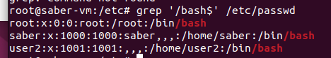
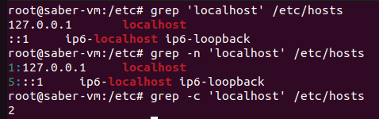
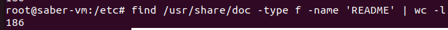
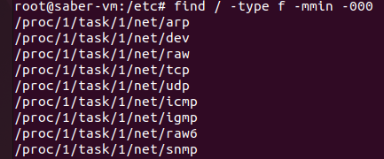
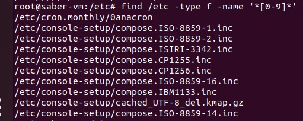

## 1. Display a list of all the users on your system who log in with the Bash shell as a default.
```bash

grep '/bash$' /etc/passwd
```

## 2. From the /etc/group directory, display all lines starting with the string "daemon".
```bash

grep '^daemon' /etc/group
```

## 3. Print all the lines from the same file that don't contain the string.
```bash
grep [^daemon] /etc/group
```
## 4. Display localhost information from the /etc/hosts file, display the line number(s) matching the search string and count the number of occurrences of the string.
```bash

grep 'localhost' /etc/hosts
```
```bash

grep -n 'localhost' /etc/hosts
```
```bash

grep -c 'localhost' /etc/hosts
```

## 5. Display a list of /usr/share/doc subdirectories containing information about shells.
```bash

find /usr/share/doc -type d | grep 'shell'
```

## 6. How many README files do these subdirectories contain? Don't count anything in the form of "README.a_string".
```bash

find /usr/share/doc -type f -name 'README' | wc -l
```

## 7. Make a list of files in your home directory that were changed less that 10 hours ago, using grep, but leave out directories.
```bash

find / -type f -mmin -600
```

## 8. Can you find an alternative for wc -l, using grep?
used in question 4
```bash
grep -c 
```
## 9. Using the file system table (/etc/fstab for instance), list local disk devices.
```bash
grep '^/dev/' /etc/fstab

```
## 10. Display configuration files in /etc that contain numbers in their names.
```bash
find /etc -type f -name '*[0-9]*'
```
