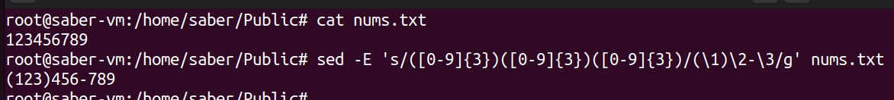

## 1. Give the AWK script that displays the word frequency of a text.
```bash

 awk -f ex2.awk test.txt
```

## 2. Create an AWK script that show the number of repetition of a specific string in a list of strings then inverse it.
```bash

awk -v target="le" '{ for (i=1; i<=NF; i++) if ($i == target) count++ } END { print count }' test.txt
```

## 3.iven a list of telephone numbers of the form 123456789 use sed to rewrite them as (123)456-789.
```bash
sed -E 's/([0-9]{3})([0-9]{3})([0-9]{3})/(\1)\2-\3/g' phone_numbers.txt  
```

## 4. se sed to select and convert all file names with suffix .html given as output by ls into capital letters with suffix .HTM. Check out command y in sed man page Use sed to extract full user names from /etc/passwd

```bash

ls *.html | sed 's/\(.*\)\.html$/\U\1.HTM/'
```