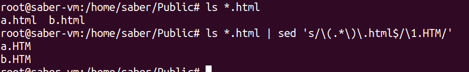

## 1. Give the AWK script that displays the word frequency of a text.
```bash

 awk -f ex2.awk test.txt
```

## 2. Create an AWK script that show the number of repetition of a specific string in a list of strings then inverse it.
```bash

awk -v target="le" '{ for (i=1; i<=NF; i++) if ($i == target) count++ } END { print count }' test.txt
```

## 3.iven a list of telephone numbers of the form 123456789 use sed to rewrite them as (123)456-789.
```bash
sed -E 's/([0-9]{3})([0-9]{3})([0-9]{3})/(\1)\2-\3/g' phone_numbers.txt  
```

## 4. se sed to select and convert all file names with suffix .html given as output by ls into capital letters with suffix .HTM. Check out command y in sed man page U

```bash

ls *.html | sed 's/\(.*\)\.html$/\U\1.HTM/'
```


## 4. Write a program with the following behavior: 

Threads are created (their number being passed as a parameter when launching the program);

Each thread displays a message (for exampleHello  !);

The principal thread waits for the termination of the various threads created

Each thread shows his PID

Edit the program that each thread receive it’s priority & print it.
```bash

import threading
import time

def thread_function(priority):

    time.sleep(1)
    thread_id = threading.get_ident()
    print(f"Hello! thread ID {thread_id} , priority {priority}")

def main(num_threads):
    threads = []
    
    for i in range(num_threads):
        priority = i + 1
        thread = threading.Thread(target=thread_function, args=(priority,))

        thread.start()
        threads.append(thread)
    
    for thread in threads:
        thread.join()


if __name__ == "__main__":
    num_threads = 4
    main(num_threads)

```
