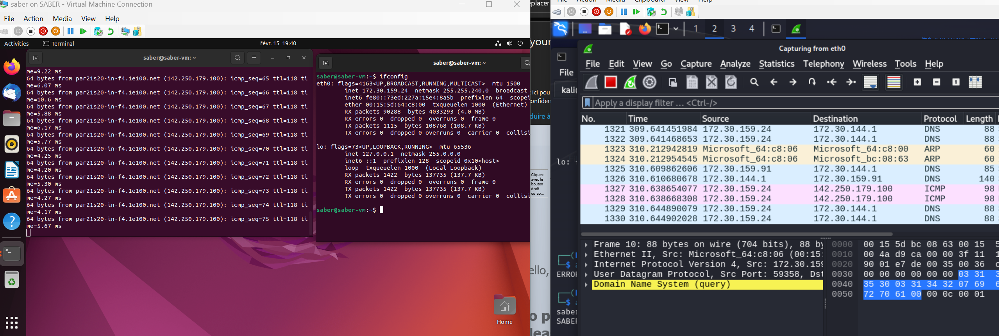
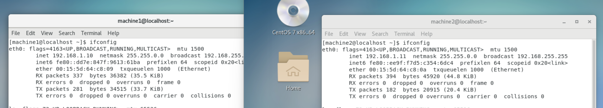
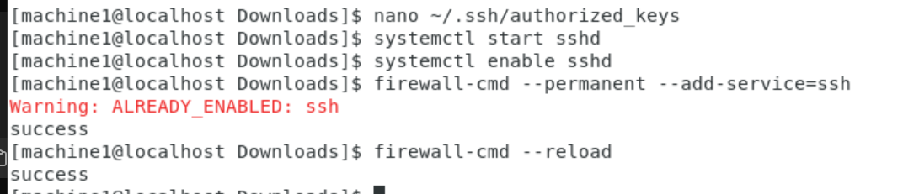
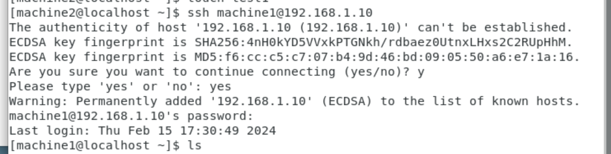
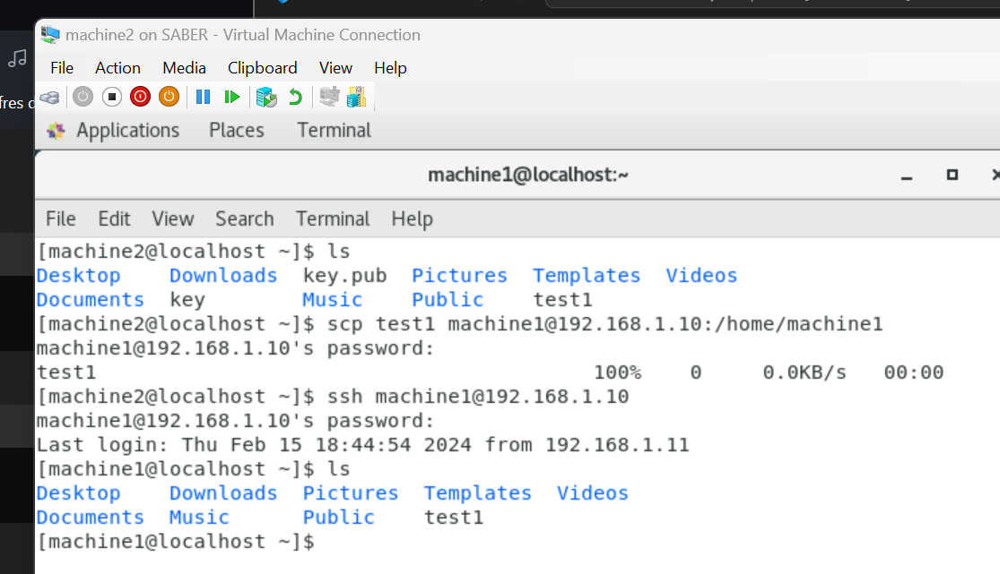
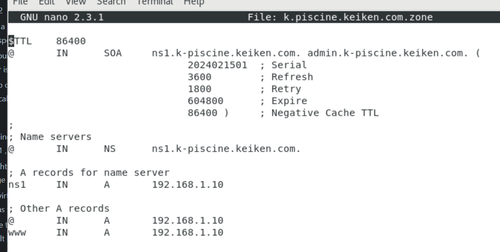
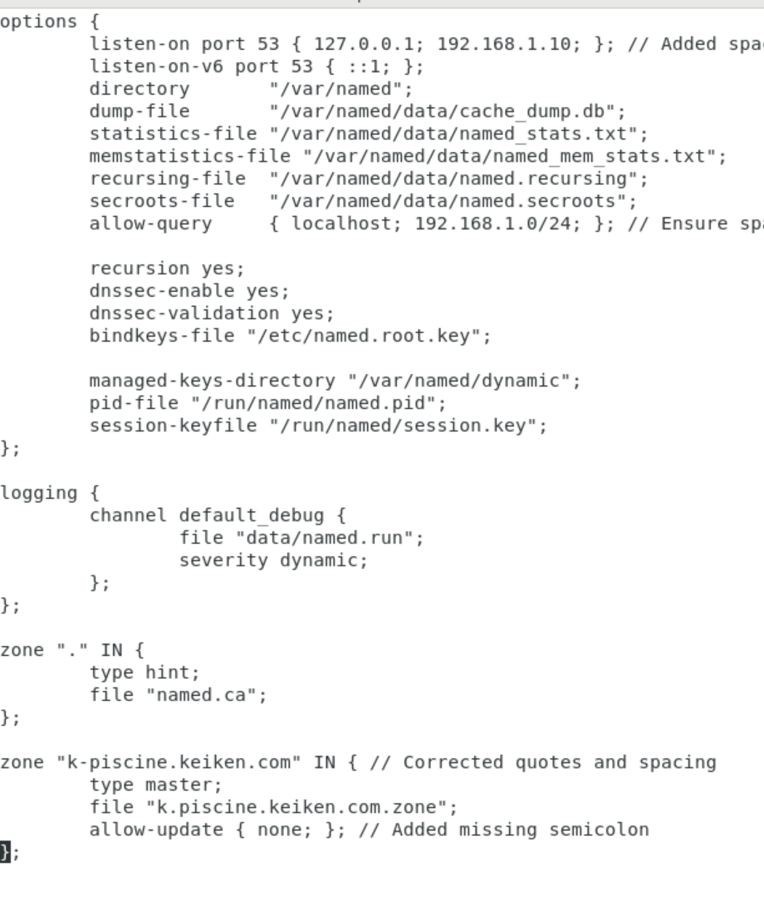
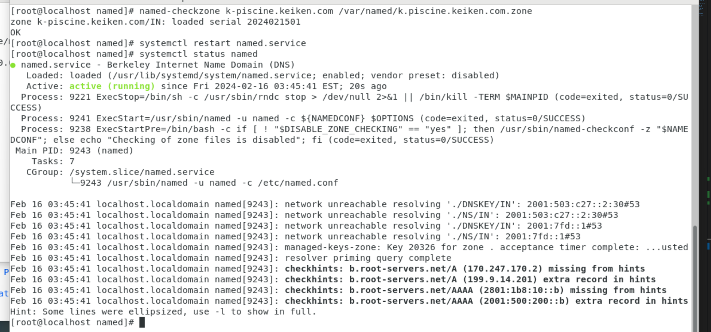

## 1. Getting hands dirty with networking

```bash

 echo 1 > /proc/sys/net/ipv4/ip_forward
```
```bash

sudo bettercap -iface eth0
```
```bash

 set arp.spoof.fullduplex true
```

```bash

set arp.spoof.targets 172.30.144.159.24
```
```bash

arp.spoof on
```
I have managed to track all requests comming from the ubunto vm on the left side as shown in the image bellow.


## 1. Create two centos VM with a bridge network - an IP adress that you define (not a container) - machine 1 & machine 2

## 2. Generate a private key on machine 2 using openssl - and the corresponding public key.
on machine2:

```bash
ssh-keygen -t rsa -b 2048
```
on machine1
```bash
mkdir -p ~/.ssh
touch ~/.ssh/authorized_keys
chmod 600 ~/.ssh/authorized_keys
```
and copy the content of key.pub in authorized_keys

start ssh and allow it through the firewall (on machine1):

## 3. Deploy your public key on machine 1 and make sure the ssh server is up and that the local fireweall allows it 
```bash
systemctl start sshd
systemctl enable sshd
firewall-cmd --permanent --add-service=ssh
firewall-cmd --reload

```

## 4. Use ssh to connect from machine 2 to machine 1 + scp to send a locally created file to machine 1
on machine2:
```bash
ssh machine1@192.168.1.10

```
 
To transfer file from machine1 to machine2:
```bash
scp test1 machine1@192.168.1.10:/home/machine1
```


## 1. Install a bind service and create a local domain on machine 1 , using ssh from machine 1.
yum install bind bind-utils
```bash
systemctl start named
systemctl enable named

```
## 1. Install an http server (httpd) and start it with a default index page that contains : welcome to keiken

## 2. Create a virtual interface with a special IP not in the same network as the bridge

## 3. Make sure that the http server listens to this IP and not the default bridge one.

## 4. On the bind server create a zone file that manages  the  k-piscine.keiken.com  with a A record that points to this IP.
Pour valider le zone file
```bash
sudo named-checkzone k-piscine.keiken.com /var/named/k.piscine.keiken.com.zone

```
restart bind
```bash
systemctl restart named.service

```



and check it's status
```bash
systemctl status named.service

```

## 6. Configure the routing tables of both machines so that the trafic is forwarded to the right eth adapter - hint : allow forwarding on machine 1 .

## 7. Configure machine 2 dns to point to the bind.

## 8. Access from the browser of machine 1 to the welcome page 

## 9. Create on machine 1 a self signed certificate with openssl

## 10. Deploy the certificate on the welcome page  