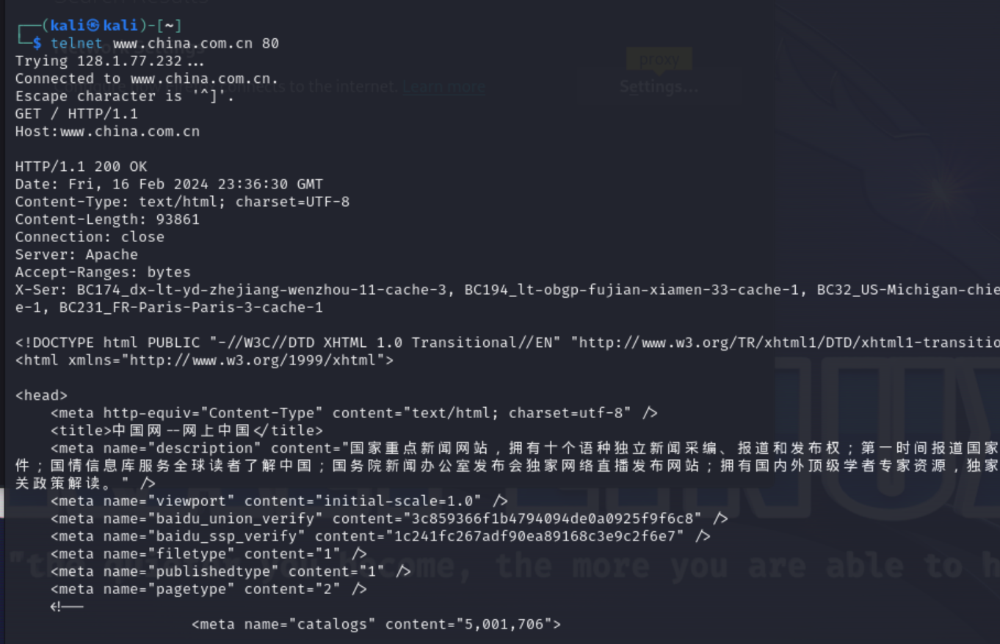

## 1. Connect
```bash

tag login user@gmail.com password
```

## 1. Connect
```bash

tag LIST "" "*"

```

## 1. Connect
```bash

tag login user@gmail.com password
```

## 1. Connect
```bash

tag login user@gmail.com password
```

## 1. Sending an HTTP Request to a Web Server Using Telnet
```bash

 sudo apt-get update
 sudo apt-get install telnet
 telnet www.china.com.cn

 get / http/1.1
 host: www.china.com.cn
```

## 2. Intercepting an HTTP Request Coming to Your Browser Using Netcat

```bash
nc -lvp 8080

```

Configure the proxy in the browser


```bash
nc -lvp 8080

```

 With the proxy configured any HTTP request from my browser will be intercepted by Netcat, allowing me to view the request headers and payload

 i can also send a response from the cli

 

#  Difference Between HTTP/1 and HTTP/2
HTTP/1.x:
•	Text-based Protocol: HTTP/1.x uses a text-based format for requests and responses, making it easy to read by humans but less efficient for parsing and network transmission.
•	One Request Per Connection: In its initial version (HTTP/1.0), each request requires a separate TCP connection. HTTP/1.1 improved this with persistent connections, but it still processes one request at a time per connection, leading to potential delays (head-of-line blocking).
•	Headers Always Sent: HTTP/1.x sends headers with every request, even if the same page or elements are requested multiple times, leading to unnecessary overhead.
HTTP/2:
•	Binary Protocol: HTTP/2 uses a binary framing layer for communication, which is not human-readable but significantly more efficient for parsing and reduces transmission overhead.
•	Multiplexing: Multiple requests and responses can be sent back and forth simultaneously over a single connection without waiting for the first to complete, effectively eliminating the head-of-line blocking issue found in HTTP/1.x.
•	Header Compression: HTTP/2 introduces HPACK compression for headers, reducing the size of the headers that need to be transmitted. This is especially beneficial for web pages that make numerous requests to the same server.
•	Server Push: HTTP/2 allows servers to proactively send resources to the client (browser) before the browser requests them, potentially reducing loading times for web pages.
HTTP/2 is designed to be significantly more efficient, reducing latency, and improving web page load times compared to HTTP/1.x. It's worth noting that HTTP/2 maintains high-level compatibility with HTTP/1.x methods, status codes, and semantics, meaning the fundamental concepts of HTTP remain unchanged, allowing for a smooth transition.

