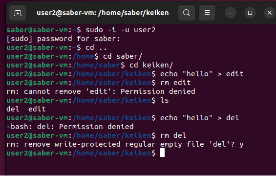

## 1. How is permission granted to delete a file?

The files permissions are maneged by the directory that contains it, and the user must have have both execute and write permissions to execute this task. The first one allows the user to modify the content of the directory and the later one allows the user to perform operations like file suppression.

## 2. Create a file that your colleague can edit but not delete and another he can delete but not edit
```bash

sudo usermod -aG keiken saber
```
```bash
sudo usermod -aG keiken user2
```

```bash

mkdir keiken
```

```bash

sudo chgrp keiken keiken
```

```bash

chmod +t keiken
```

```bash

cd keiken
```

```bash

touch edit
```

```bash

chmod 764 edit
```


```bash

touch del
```
```bash

chmod 774 /home/saber/keiken
```

```bash

chmod 744 /keiken/del
```



## 3. Does it make sense to be able to assign such rights?

I can think of one case where the second assignments could be useful, which is for logging data.

## 4. What are the practical consequences of this experience?

understanding more the purpose of each permission.