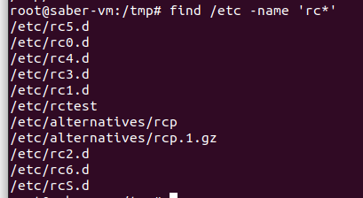
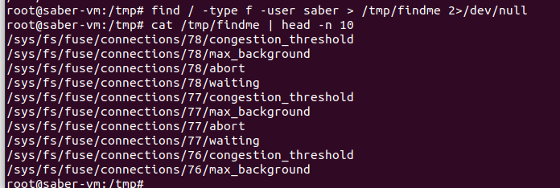
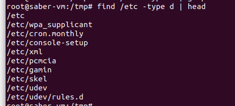
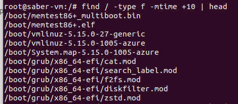

## 1. Find all files under the /etc directory whose names begin with rc:


```bash

find /etc -name 'rc*'
```

## 2. Find all regular files belonging to you, output the result to the file /tmp/findme, and redirect errors to /dev/null:

```bash
find / -type f -user saber > /tmp/findme 2>/dev/null
```


## 3. Find all subdirectories of /etc:


```bash

find /etc -type d
```


## 4. Find all regular files under your home directory that have not been modified in the last 10 days:

```bash

find /home/saber -type f -mtime +10
```

## 5. The 10 largest file in your computer
```bash


```

## 3. Does it make sense to be able to assign such rights?

I can think of one case where the second assignments could be useful, which is for logging data.

## 4. What are the practical consequences of this experience?

understanding more the purpose of each permission.