## Lesson 1: Guided Exercise: Contrasting Kubernetes Distributions
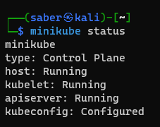
## Lesson 1: Guided Exercise: Connecting kubectl to Your Cluster
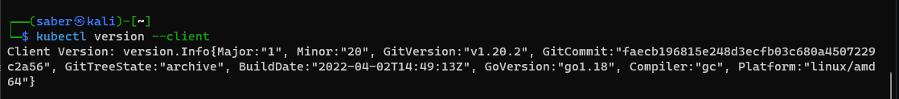
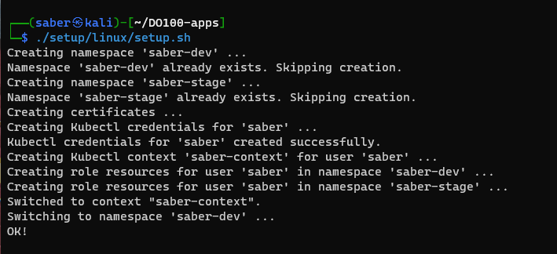
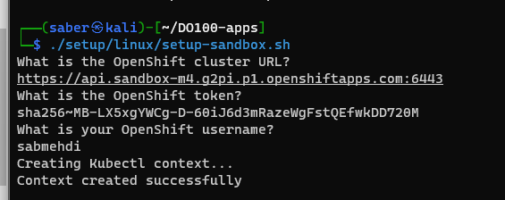
## Lesson 1: Guided Exercise: Running and Interacting with Your First Application
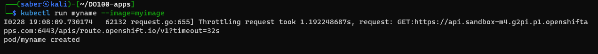

## Lesson 2: Guided Exercise: Deploying Managed Applications
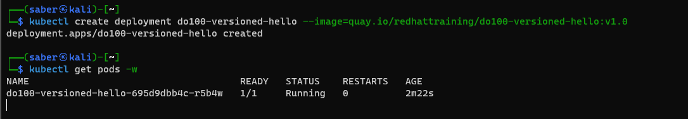
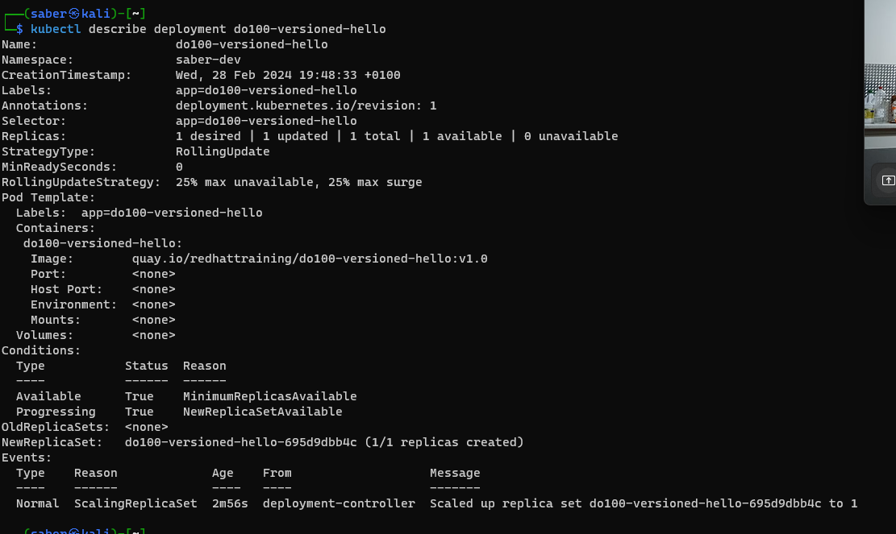
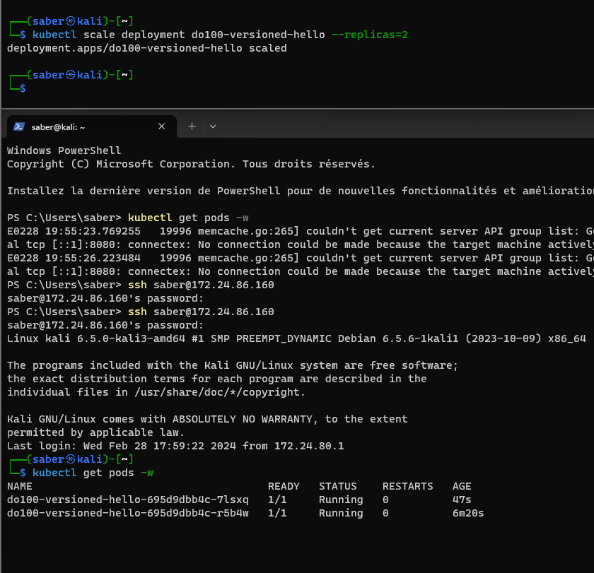
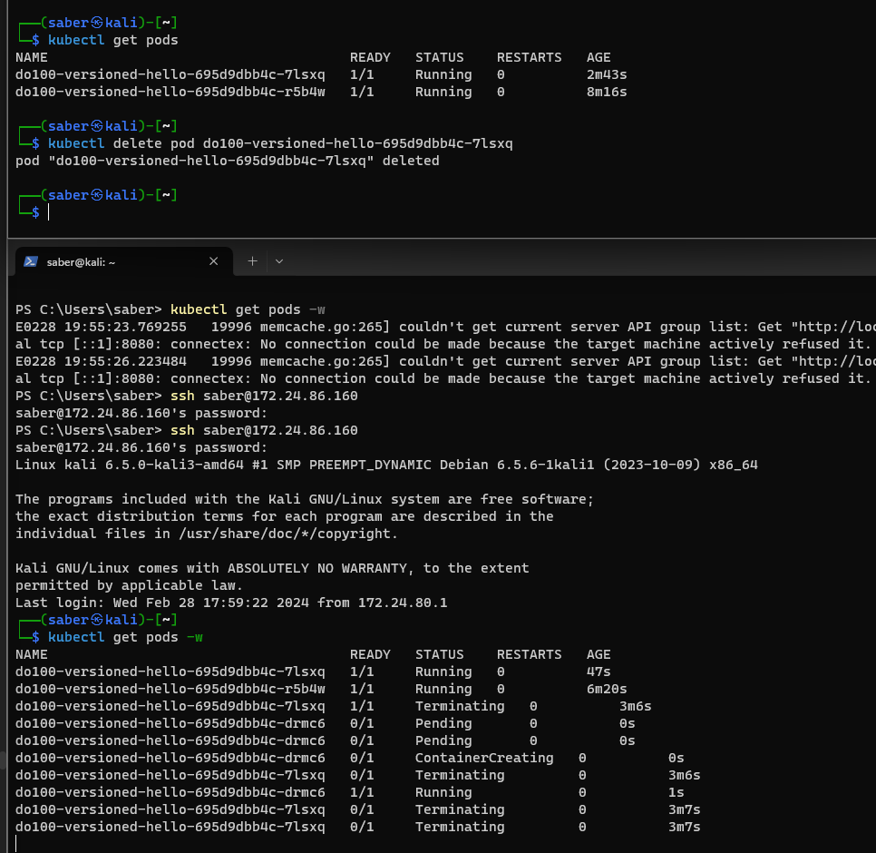
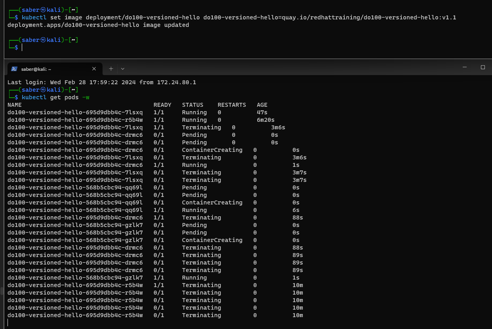
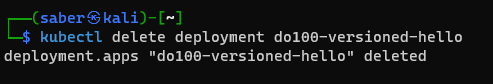