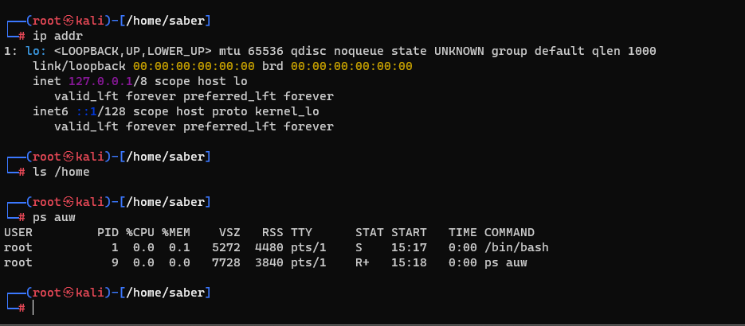

## 1.  Creating Namespaces
```bash

sudo unshare --net --pid --mount --fork --map-root-user /bin/bash


```
## 2.  Setting Up Network Isolation

```bash

ip link set lo up


```
## 3.   Setting Up Filesystem Isolation

```bash
mount -t tmpfs tmpfs /home


```

## 3.    Setting Up Process Isolation

```bash
mount -t proc proc /proc


```
